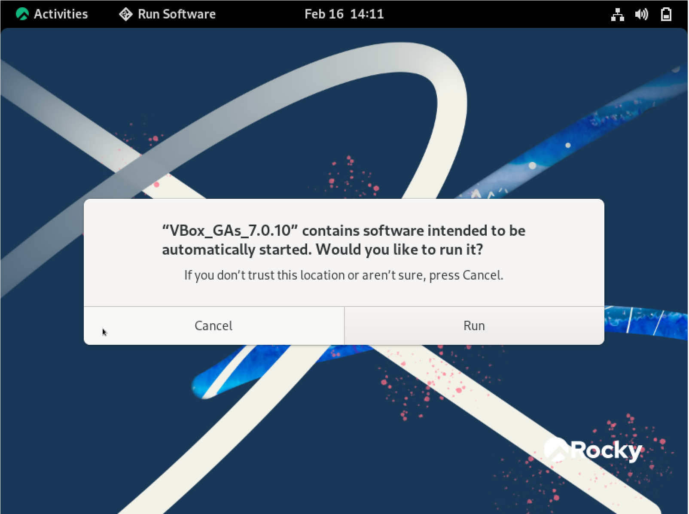

---
## Front matter
lang: ru-RU
title: Лабораторная работа №1
subtitle: Основы информационной безопасности
author:
  - Ищенко Ирина Олеговна НПИбд-02-22
institute:
  - Российский университет дружбы народов, Москва, Россия
date: 16 февраля 2024

## i18n babel
babel-lang: russian
babel-otherlangs: english

## Formatting pdf
toc: false
toc-title: Содержание
slide_level: 2
aspectratio: 169
section-titles: true
theme: metropolis
header-includes:
 - \metroset{progressbar=frametitle,sectionpage=progressbar,numbering=fraction}
 - '\makeatletter'
 - '\beamer@ignorenonframefalse'
 - '\makeatother'
---

## Цель работы

Приобретение практических навыков установки операционной системы на виртуальную машину, настройки минимально необходимых для дальнейшей работы сервисов.

# Выполнение работы

## Создание виртуальной машины

{#fig:001 width=50%}

## Настройка параметров виртуальной машины

• Объем оперативной памяти
• Создание виртуального диска на 40 Гб
• Добавление образа оптического диска Rocky

{#fig:002 width=50%}

## Место установки

{#fig:003 width=50%}

## Отключение

{#fig:004 width=50%}

## Сетевое соединение

{#fig:005 width=50%}

## Пароль для root

{#fig:006 width=50%}

## Дополнение

{#fig:007 width=50%}

# Выполнение домашнего задания

## 

{#fig:008 width=50%}

## 

{#fig:009 width=50%}

## 

{#fig:0010 width=50%}

## Вывод

В ходе выполнения лабораторной рабооты я приобрела практические навыки установки операционной системы LInux дистрибутив Rocky на виртуальную машину, настройки минимально необходимых для дальнейшей работы сервисов.

