---
## Front matter
title: "Отчет по лабораторной работе №1"
subtitle: "Дисциплина: Основы информационной безопасности"
author: "Ищенко Ирина Олеговна НПИбд-02-22"

## Generic otions
lang: ru-RU
toc-title: "Содержание"

## Bibliography
bibliography: bib/cite.bib
csl: pandoc/csl/gost-r-7-0-5-2008-numeric.csl

## Pdf output format
toc: true # Table of contents
toc-depth: 2
lof: true # List of figures
lot: true # List of tables
fontsize: 12pt
linestretch: 1.5
papersize: a4
documentclass: scrreprt
## I18n polyglossia
polyglossia-lang:
  name: russian
  options:
	- spelling=modern
	- babelshorthands=true
polyglossia-otherlangs:
  name: english
## I18n babel
babel-lang: russian
babel-otherlangs: english
## Fonts
mainfont: PT Serif
romanfont: PT Serif
sansfont: PT Sans
monofont: PT Mono
mainfontoptions: Ligatures=TeX
romanfontoptions: Ligatures=TeX
sansfontoptions: Ligatures=TeX,Scale=MatchLowercase
monofontoptions: Scale=MatchLowercase,Scale=0.9
## Biblatex
biblatex: true
biblio-style: "gost-numeric"
biblatexoptions:
  - parentracker=true
  - backend=biber
  - hyperref=auto
  - language=auto
  - autolang=other*
  - citestyle=gost-numeric
## Pandoc-crossref LaTeX customization
figureTitle: "Рис."
tableTitle: "Таблица"
listingTitle: "Листинг"
lofTitle: "Список иллюстраций"
lotTitle: "Список таблиц"
lolTitle: "Листинги"
## Misc options
indent: true
header-includes:
  - \usepackage{indentfirst}
  - \usepackage{float} # keep figures where there are in the text
  - \floatplacement{figure}{H} # keep figures where there are in the text
---

# Цель работы

Целью данной работы является приобретение практических навыков установки операционной системы на виртуальную машину, настройки минимально
необходимых для дальнейшей работы сервисов.

# Выполнение лабораторной работы

В данной лабораторной работе мне требуется установить виртиуальную машину Oracle Virtual Box (уже установлен) операционной системы Linux и дистрибутив Rocky.
Создаем виртуальную машину и задаем ее расположение с указанием моего
логина, типа операционной системы (Linux, Red Hat 64-bit) и (рис. [-@fig:001]).

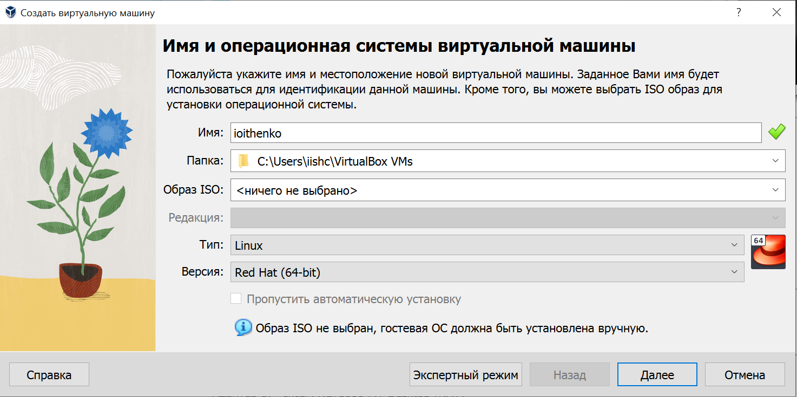{#fig:001 width=70%}

Указываем объем оперативной памяти виртуальной машины, я указала 2048
Мб (рис. [-@fig:002]). Создаем новый виртуальный жесткий диск.

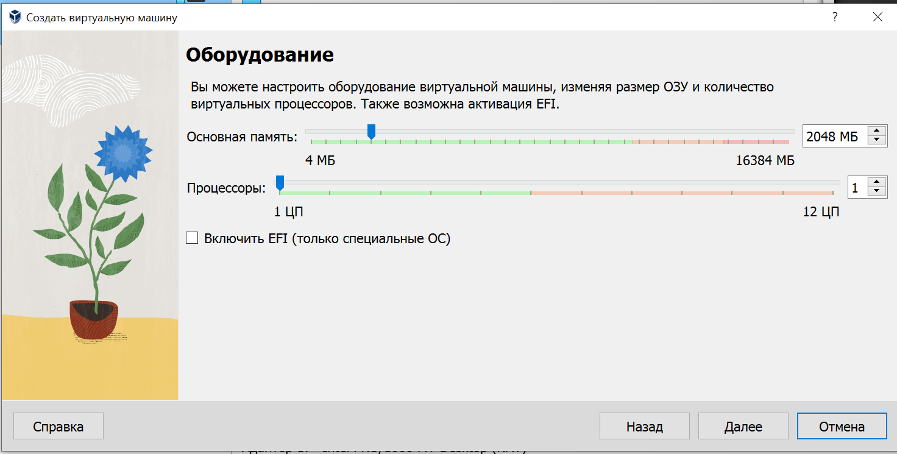{#fig:002 width=70%}

Указываем имя и размер виртуального диска – 40Гб (рис. [-@fig:003]). Проверяем расположение файла.

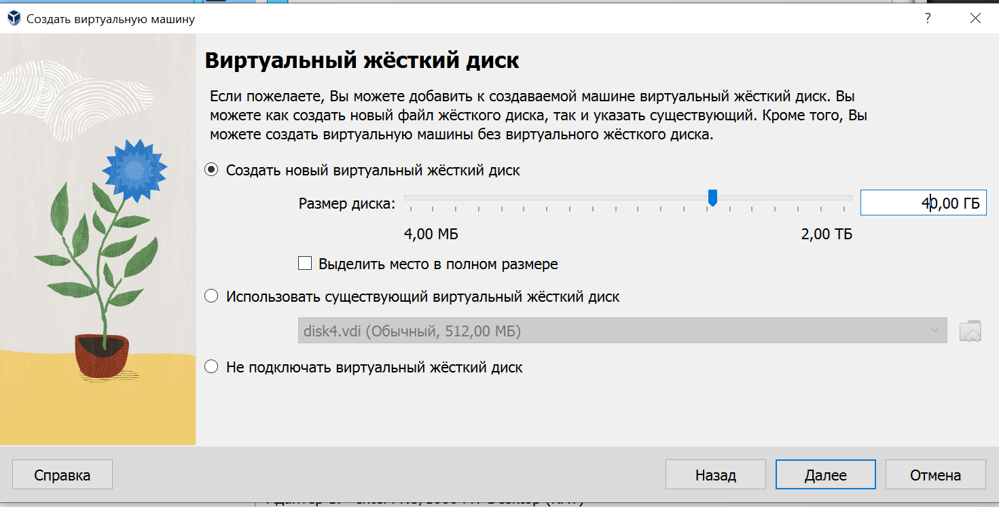{#fig:003 width=70%}

Во вкладке носители добавляем новый привод оптических дисков и выбираем
образ, для этого используем скачанный образ Rocky (рис. [-@fig:004]).

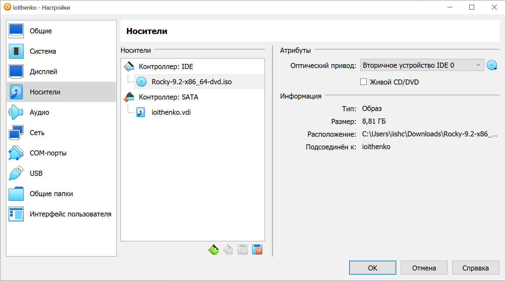{#fig:004 width=70%}

Запускаем виртуальную машину (рис. [-@fig:005]). Переходим к настройкам установки операционной системы и выбираем английский язык для интерфейса.При выборе места установки оставляем параметры, которые были выставлены автоматически (рис. [-@fig:006]). В разделе выбора программ указываем в качестве базового окружения Server with GUI , а в качестве дополнения — Development Tools (рис. [-@fig:007]). Отключаем KDUMP (рис. [-@fig:008]).

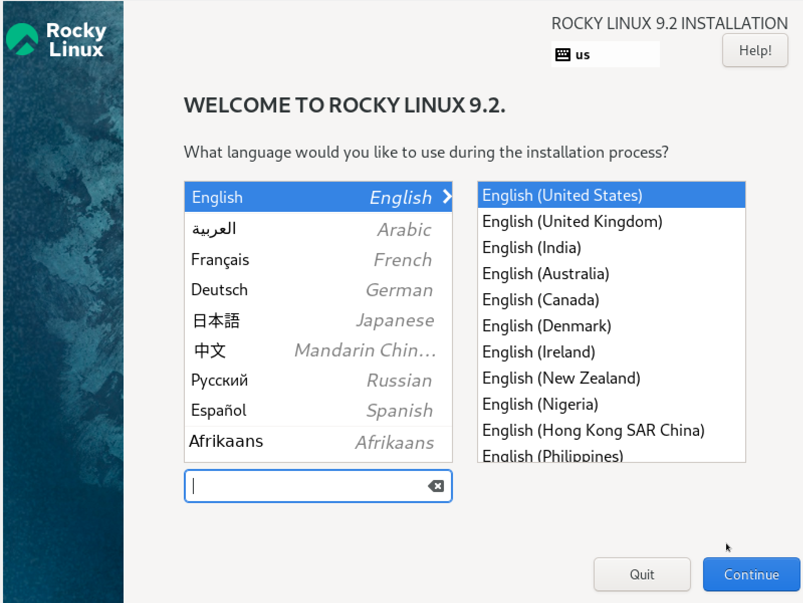{#fig:005 width=70%}

{#fig:006 width=70%}

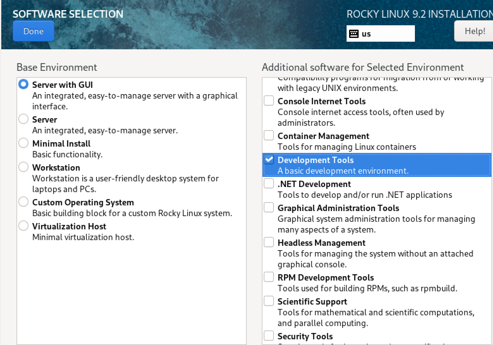{#fig:007 width=70%}

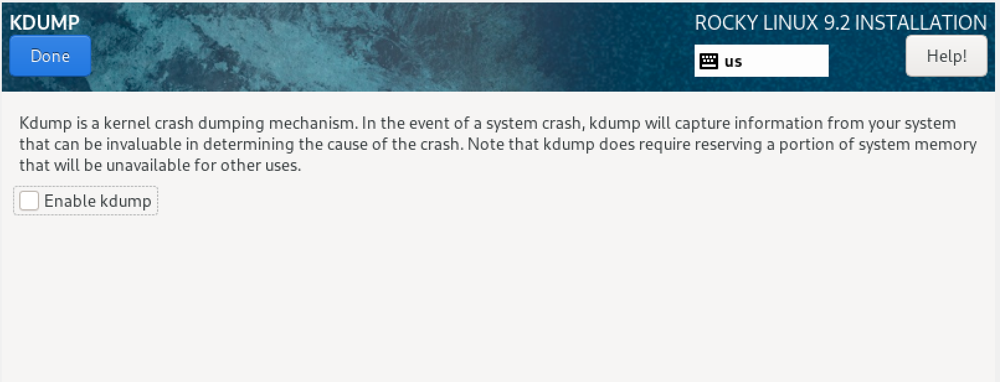{#fig:008 width=70%}

Включаем сетевое соединение и в качестве имени узла указываем
ioithenko.localdomain (рис. [-@fig:009]).

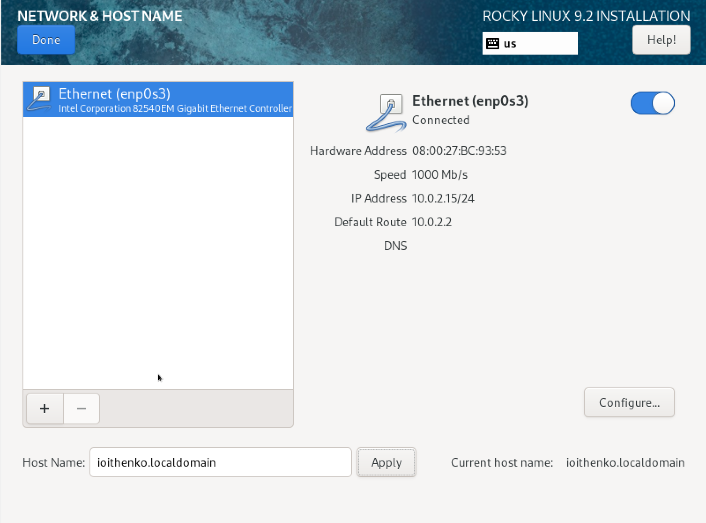{#fig:009 width=70%}

Устанавливаем пароль для root и пользователя с правами администратора (рис. [-@fig:0010]).

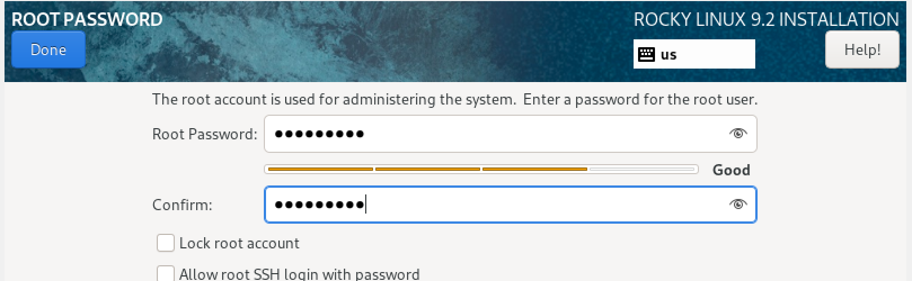{#fig:0010 width=70%}

Начинаем процесс установки.
Дожидаемся и завершаем установку. После успешной установки выполняем
перезагрузку системы. Последним пунктом нашей лабораторной работы становится подключение дополнений ОС (рис. [-@fig:0011]) и (рис. [-@fig:0012]).

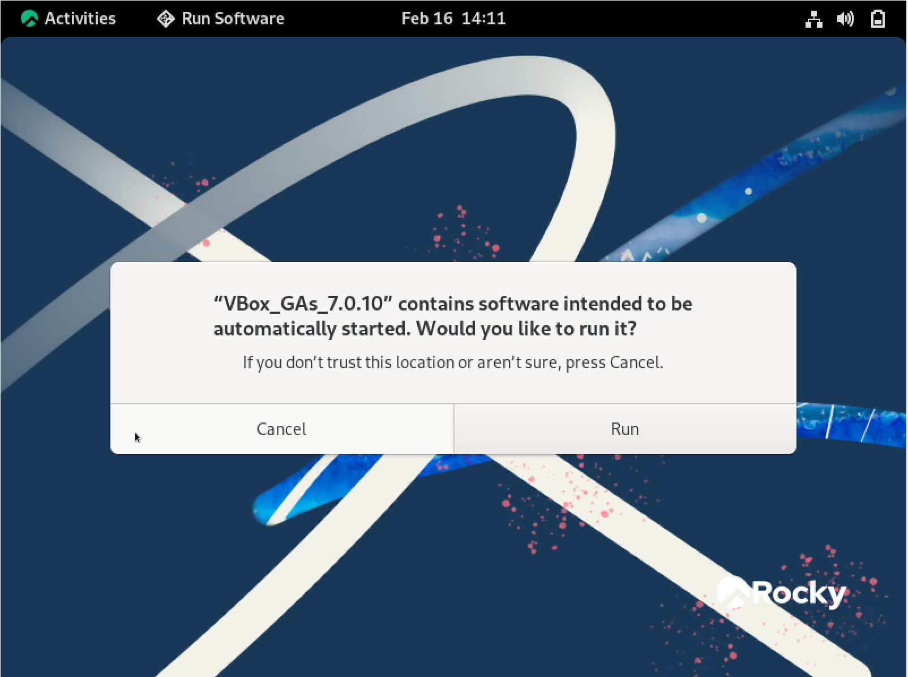{#fig:0011 width=70%}

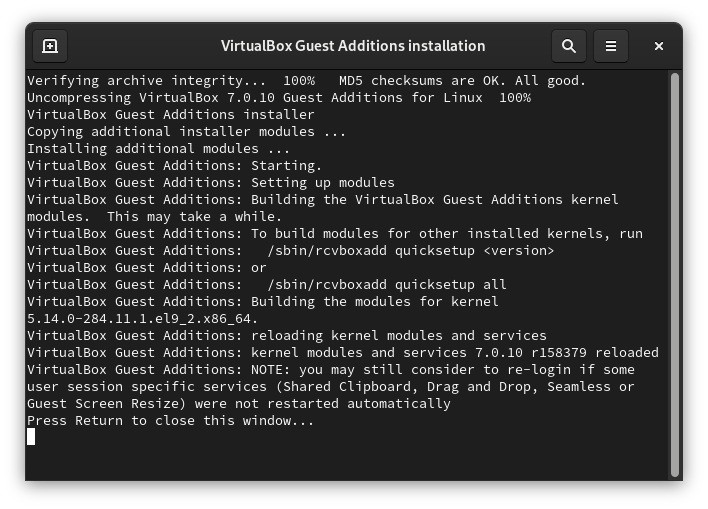{#fig:0012 width=70%}

# Выполнение домашнего задания

Получили следующую информацию (рис. [-@fig:0013]), (рис. [-@fig:0014]), (рис. [-@fig:0015]):
 
1.Версия ядра Linux (Linux version)
2.Частота процессора (Detected Mhz processor) 
3.Модель процессора (CPU0)
4.Объём доступной оперативной памяти (Memory available)
5.Тип обнаруженного гипервизора (Hypervisor detected) 
6.Тип файловой системы корневого раздела
7.Последовательность монтирования файловых систем 

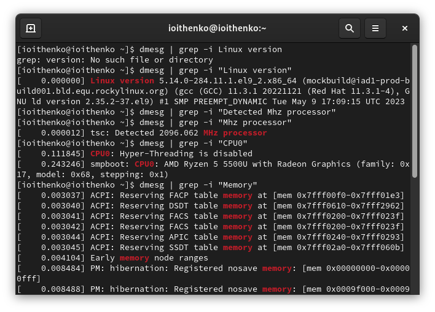{#fig:0013 width=70%}

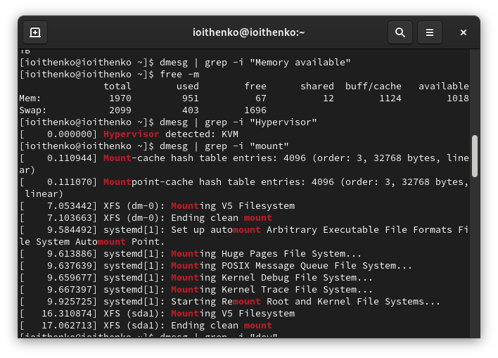{#fig:0014 width=70%}

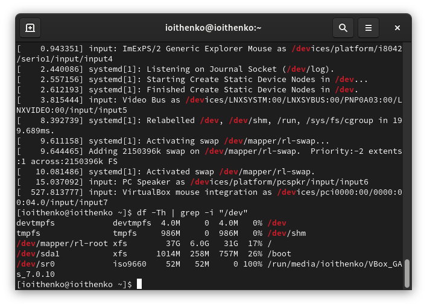{#fig:0015 width=70%}

# Ответы на контрольные вопросы

1. Какую информацию содержит учётная запись пользователя?

Учетная запись пользователя содержит информацию, которая необходима для
индентификации пользователя в системе и его аавторизации: - Имя пользователя
- Идентефикационный номер пользователя - идентификационный номер группы
- Пароль - Полное имя - Начальная оболочка - Домашний каталог

2. Укажите команды терминала и приведите примеры:

–help - для получения справки по команде; cd - для перемещения по файловой
системе; ls - для просмотра содержимого каталога; du - для определения объёма
каталога; rm/touch - для создания / удаления каталогов / файлов; chmod - для
задания определённых прав на файл / каталог; history - для просмотра истории
команд.

3. Что такое файловая система? Приведите примеры с краткой характеристикой.

Файловая система — порядок, определяющий способ организации, хранения и
именования данных на носителях информации в компьютерах, а также в другом
электронном оборудовании: цифровых фотоаппаратах, мобильных телефонах и
т. п. Файловая система определяет формат содержимого и способ физического
хранения информации, которую принято группировать в виде файлов. NTFS -
файловая система ОС Windows, которая поддерживает разграничение доступа
для различных групп пользователей.

4.Как посмотреть, какие файловые системы подмонтированы в ОС?

Команды df и findmnt выводят информацию о том, какие файловые системы
подмонтированы в ОС.

5.Как удалить зависший процесс?
Команда killall позволяет удалить зависший процесс.

# Выводы

В ходе выполнения лабораторной рабооты я приобрела практические навыки
установки операционной системы на виртуальную машину, настройки минимально необходимых для дальнейшей работы сервисов.

