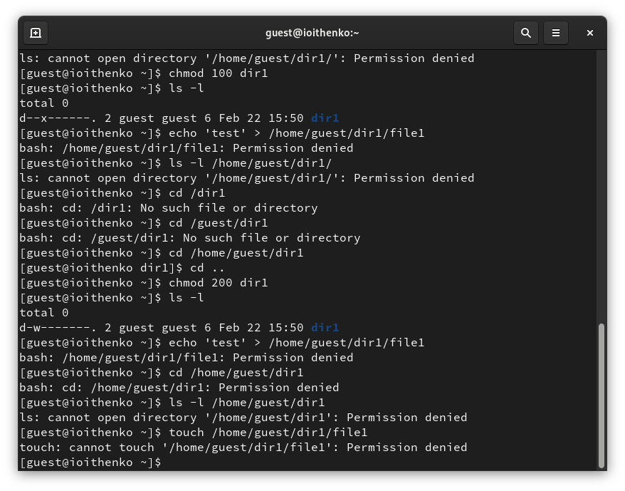

---
## Front matter
title: "Отчёт по лабораторной работе №2"
subtitle: "Основы информационной безопасности"
author: "Ищенко Ирина НПИбд-02-22"

## Generic otions
lang: ru-RU
toc-title: "Содержание"

## Bibliography
bibliography: bib/cite.bib
csl: pandoc/csl/gost-r-7-0-5-2008-numeric.csl

## Pdf output format
toc: true # Table of contents
toc-depth: 2
lof: true # List of figures
lot: true # List of tables
fontsize: 12pt
linestretch: 1.5
papersize: a4
documentclass: scrreprt
## I18n polyglossia
polyglossia-lang:
  name: russian
  options:
	- spelling=modern
	- babelshorthands=true
polyglossia-otherlangs:
  name: english
## I18n babel
babel-lang: russian
babel-otherlangs: english
## Fonts
mainfont: PT Serif
romanfont: PT Serif
sansfont: PT Sans
monofont: PT Mono
mainfontoptions: Ligatures=TeX
romanfontoptions: Ligatures=TeX
sansfontoptions: Ligatures=TeX,Scale=MatchLowercase
monofontoptions: Scale=MatchLowercase,Scale=0.9
## Biblatex
biblatex: true
biblio-style: "gost-numeric"
biblatexoptions:
  - parentracker=true
  - backend=biber
  - hyperref=auto
  - language=auto
  - autolang=other*
  - citestyle=gost-numeric
## Pandoc-crossref LaTeX customization
figureTitle: "Рис."
tableTitle: "Таблица"
listingTitle: "Листинг"
lofTitle: "Список иллюстраций"
lotTitle: "Список таблиц"
lolTitle: "Листинги"
## Misc options
indent: true
header-includes:
  - \usepackage{indentfirst}
  - \usepackage{float} # keep figures where there are in the text
  - \floatplacement{figure}{H} # keep figures where there are in the text
---

# Цель работы

Получение практических навыков работы в консоли с атрибутами файлов, закрепление теоретических основ дискреционного разграничения доступа в современных системах с открытым кодом на базе ОС Linux [@infosec].

# Выполнение лабораторной работы

В установленной при выполнении предыдущей лабораторной работы
операционной системе создали учётную запись пользователя guest (использую учётную запись администратора):
useradd guest
Задайли пароль для пользователя guest (использую учётную запись администратора):
passwd guest
Вошли в систему от имени пользователя guest.
Определили директорию, в которой я нахожусь, командой pwd: /root не является домашней директорией. Переходим в домашнюю директорию.
Уточним имя пользователя командой whoami - guest.
Уточниv имя пользователя, его группу, а также группы, куда входит пользователь, командой id. Выведенные значения: uid=1001(guest) groups=1001(guest). Вывод id с выводом команды groups совпадает, пользователь принадлежит группе guest.
Полученная информация об имени пользователя с данными,
выводимыми в приглашении командной строки, совпадает.
Просмотрим файл /etc/passwd командой
cat /etc/passwd | grep guest
Находим в нём свою учётную запись. Uid пользователя: 1001.
gid пользователя: 1001. Найденные значения с полученными в предыдущих пунктах совпадают (рис. [-@fig:001]).

{#fig:001 width=70%}

Определим существующие в системе директории командой
ls -l /home/
Мне удалось ли вам получить список поддиректорий директории /home. На директориях установлены права на чтение, запись и исполнение.
Проверим, какие расширенные атрибуты установлены на поддиректориях, находящихся в директории /home, командой:
lsattr /home
Мне удалось ли вам увидеть расширенные атрибуты директории, они отсутствуют.
Мне не удалось ли вам увидеть расширенные атрибуты директорий других
пользователей.
Создадим в домашней директории поддиректорию dir1 командой
mkdir dir1
Определим командами ls -l и lsattr, какие права доступа и расширенные атрибуты были выставлены на директорию dir1: никаких (рис. [-@fig:002]).

{#fig:002 width=70%}

Снимем с директории dir1 все атрибуты командой
chmod 000 dir1
и проверим с её помощью правильность выполнения команды
ls -l
Попытаемся создать в директории dir1 файл file1 командой
echo "test" > /home/guest/dir1/file1
Я получила отказ в выполнении операции по созданию файла, так как мы ограничили права на данную директорию, отменили права на чтение, исполнение и запись.
Cообщение об ошибке: permission denied (разрешение отклонено).
Проверим командой
ls -l /home/guest/dir1
действительно ли файл file1 не находится внутри директории dir1, разрешение на выоплнение команды также отклонено (рис. [-@fig:003]), (рис. [-@fig:004]) и (рис. [-@fig:005]).

{#fig:003 width=70%}

{#fig:004 width=70%}

{#fig:005 width=70%}

Заполним таблицу «Установленные права и разрешённые действия», присвоив по очереди права на доступ к директории [-@tbl:1]

: Установленные права и разрешенные действия {#tbl:1} 

| Права директории | Права файла | Создание файла | Удаление файла | Запись в файл | Чтение файла | Смена директории | Просмотр файлов в директории | Переименование файла | Смена атрибутов файла |
|--------- | --------- | --------- | --------- | --------- | --------- | --------- | --------- | --------- | --------- |
| 000 | 000 | - | - | - | - | - | - | - | - |
| 100 | 100 | - | - | - | - | + | - | - | + |
| 200 | 200 | - | - | - | - | - | - | - | - |
| 300 | 300 | + | + | + | - | + | - | + | + |
| 400 | 400 | - | - | - | - | - | + | - | - |
| 500 | 500 | - | - | - | + | + | + | - | + |
| 600 | 600 | - | - | - | - | - | + | - | - |
| 700 | 700 | + | + | + | + | + | + | + | + |

На основании заполненной таблицы определим те или иные минимально необходимые права для выполнения операций внутри директории
dir1, заполним табл. [-@tbl:2]

: Минимальные права для совершения операций {#tbl:2} 

| Операция | Минимальные права   на директорию | Минимальные права   на файл |
|-------------------------- |--------------------- |-----------------|
| Создание файла | 300 | 200 |
| Удаление файла | 300 | 200 |
| Чтение файла | 500 | 400 |
| Запись в файл | 300 | 200 |
| Переименование файла | 300 | 200 |
| Создание поддиректории | 300 | 300 |
| Удаление поддиректории | 300 | 300 |

# Выводы

В ходе выполнения лабораторной работы я получила практические навыки работы в консоли с атрибутами файлов, закрепление теоретических основ дискреционного разграничения доступа в современных системах с открытым кодом на базе ОС Linux.

# Список литературы{.unnumbered}

::: {#refs}
:::
