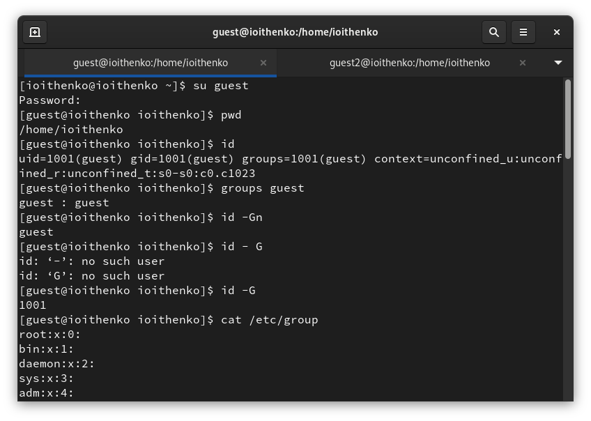
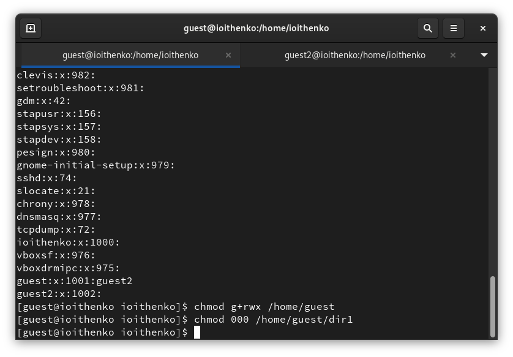
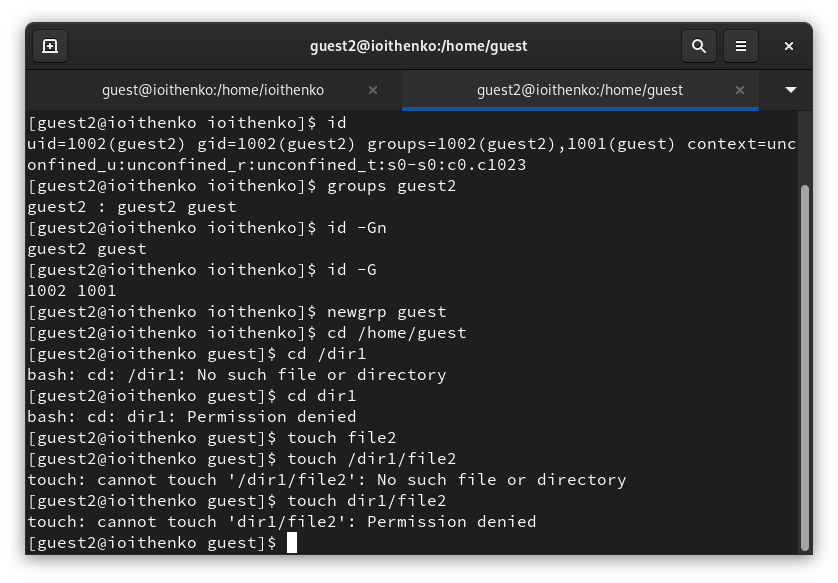
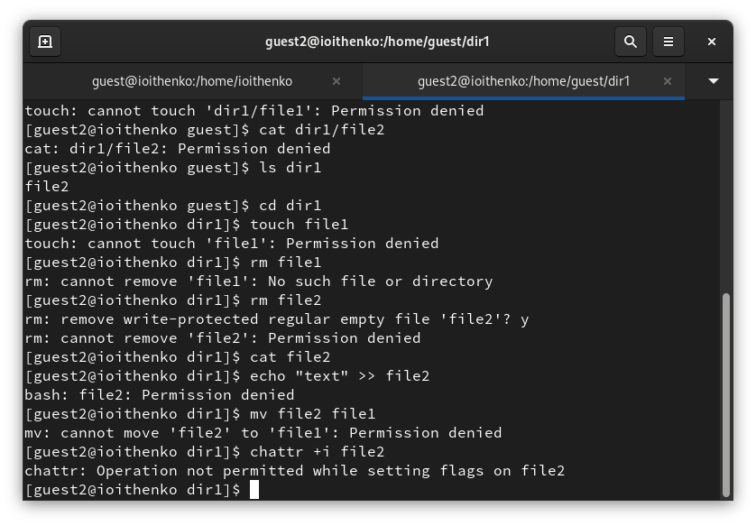
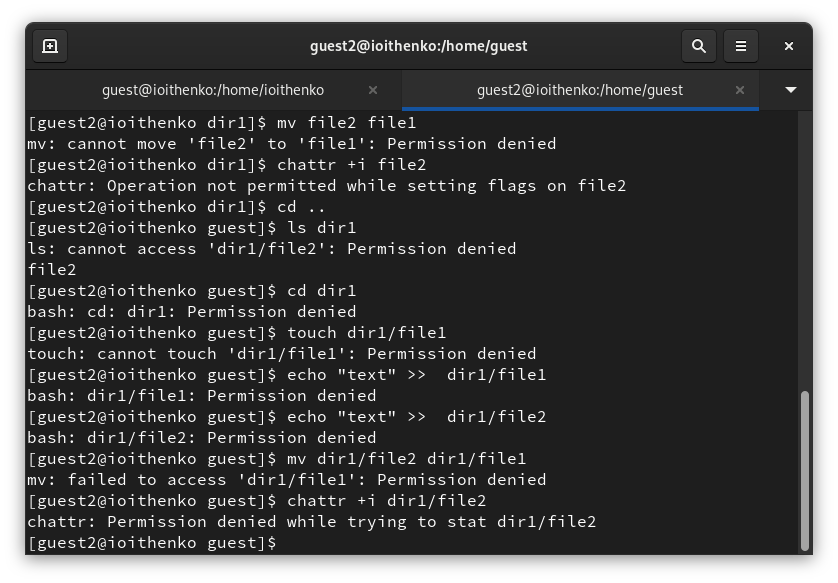
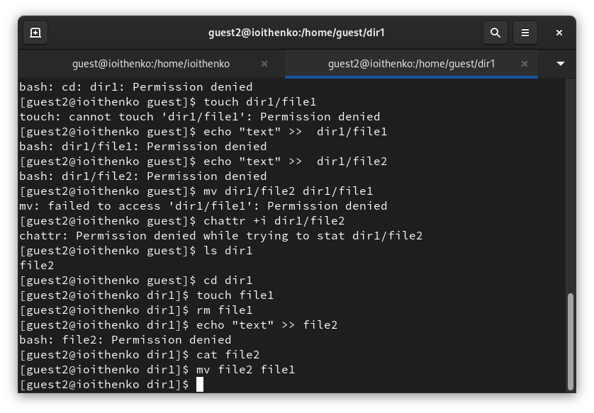
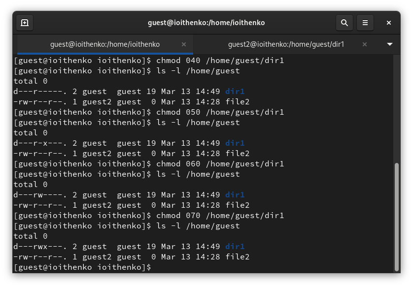

---
## Front matter
title: "Отчет по лабораторной работе №3"
subtitle: "Основы информационной безопасности"
author: "Ищенко Ирина НПИбд-02-22"

## Generic otions
lang: ru-RU
toc-title: "Содержание"

## Bibliography
bibliography: bib/cite.bib
csl: pandoc/csl/gost-r-7-0-5-2008-numeric.csl

## Pdf output format
toc: true # Table of contents
toc-depth: 2
lof: true # List of figures
lot: true # List of tables
fontsize: 12pt
linestretch: 1.5
papersize: a4
documentclass: scrreprt
## I18n polyglossia
polyglossia-lang:
  name: russian
  options:
	- spelling=modern
	- babelshorthands=true
polyglossia-otherlangs:
  name: english
## I18n babel
babel-lang: russian
babel-otherlangs: english
## Fonts
mainfont: PT Serif
romanfont: PT Serif
sansfont: PT Sans
monofont: PT Mono
mainfontoptions: Ligatures=TeX
romanfontoptions: Ligatures=TeX
sansfontoptions: Ligatures=TeX,Scale=MatchLowercase
monofontoptions: Scale=MatchLowercase,Scale=0.9
## Biblatex
biblatex: true
biblio-style: "gost-numeric"
biblatexoptions:
  - parentracker=true
  - backend=biber
  - hyperref=auto
  - language=auto
  - autolang=other*
  - citestyle=gost-numeric
## Pandoc-crossref LaTeX customization
figureTitle: "Рис."
tableTitle: "Таблица"
listingTitle: "Листинг"
lofTitle: "Список иллюстраций"
lotTitle: "Список таблиц"
lolTitle: "Листинги"
## Misc options
indent: true
header-includes:
  - \usepackage{indentfirst}
  - \usepackage{float} # keep figures where there are in the text
  - \floatplacement{figure}{H} # keep figures where there are in the text
---

# Цель работы

Получение практических навыков работы в консоли с атрибутами файлов для групп пользователей[@infosec].

# Выполнение лабораторной работы

В установленной операционной системе создадим учётную запись пользователя guest2 (использую учётную запись администратора):
useradd guest
Зададим пароль для пользователя guest (использую учётную запись администратора):
passwd guest.
Добавим пользователя guest2 в группу guest (пользователя guest создавали в предыдущей лабораторной работе).
gpasswd -a guest2 guest
Осуществим вход в систему от двух пользователей на двух разных консолях: guest на первой консоли и guest2 на второй консоли.
Для обоих пользователей командой pwd определим директорию, в которой находимся - /home/ioithenko.
Уточниv имя вашего пользователя, его группу, кто входит в неё
и к каким группам принадлежит он сам. Определиv командами
groups guest и groups guest2, в какие группы входят пользователи guest и guest2. Сравниv вывод команды groups с выводом команд id -Gn и id -G: все перечисленные команды предоставляют информацию о принадлежности пользователя группе (рис. [-@fig:001]).

{#fig:001 width=70%}

Сравним полученную информацию с содержимым файла /etc/group.
Просмотрим файл командой (рис. [-@fig:002])
cat /etc/group
В файле содержится информация о пользователе: uid, gid, groups и тд.

{#fig:002 width=70%}

От имени пользователя guest2 выполниv регистрацию пользователя
guest2 в группе guest командой (рис. [-@fig:003])
newgrp guest

{#fig:003 width=70%}

От имени пользователя guest измените права директории /home/guest,
разрешив все действия для пользователей группы:
chmod g+rwx /home/guest
От имени пользователя guest снимем с директории /home/guest/dir1
все атрибуты командой
chmod 000 dirl
и проверим правильность снятия атрибутов (рис. [-@fig:004]), (рис. [-@fig:005]), (рис. [-@fig:006]) и (рис. [-@fig:007]).

{#fig:004 width=70%}

{#fig:005 width=70%}

{#fig:006 width=70%}

{#fig:007 width=70%}

Меняя атрибуты у директории dir1 и файла file1 от имени пользователя guest и делая проверку от пользователя guest2, заполним [-@tbl:1].

: Установленные права и разрешённые действия для групп {#tbl:1}

| Права директории | Права файла | Создание файла | Удаление файла | Запись в файл | Чтение файла | Смена директории | Просмотр файлов в директории | Переименование файла | Смена атрибутов файла |
|--------- | --------- | --------- | --------- | --------- | --------- | --------- | --------- | --------- | --------- |
| 000 | 000 | - | - | - | - | - | - | - | - |
| 010 | 010 | - | - | - | - | + | - | - | - |
| 020 | 020 | - | - | - | - | - | - | - | - |
| 030 | 030 | + | + | + | - | + | - | + | + |
| 040 | 040 | - | - | - | - | - | + | - | - |
| 050 | 050 | - | - | - | + | + | + | - | + |
| 060 | 060 | - | - | - | - | - | + | - | - |
| 070 | 070 | + | + | + | + | + | + | + | + |

На основании этой таблицы заполним [-@tbl:2].

: Минимальные права для совершения операций {#tbl:2} 

| Операция | Минимальные права   на директорию | Минимальные права   на файл |
|-------------------------- |--------------------- |-----------------|
| Создание файла | 030 | 020 |
| Удаление файла | 030 | 020 |
| Чтение файла | 050 | 040 |
| Запись в файл | 030 | 020 |
| Переименование файла | 030 | 020 |
| Создание поддиректории | 030 | 030 |
| Удаление поддиректории | 030 | 030 |

# Выводы

В ходе лабораторной работы я получила практических навыков работы в консоли с атрибутами файлов для групп пользователей.

# Список литературы{.unnumbered}

::: {#refs}
:::
