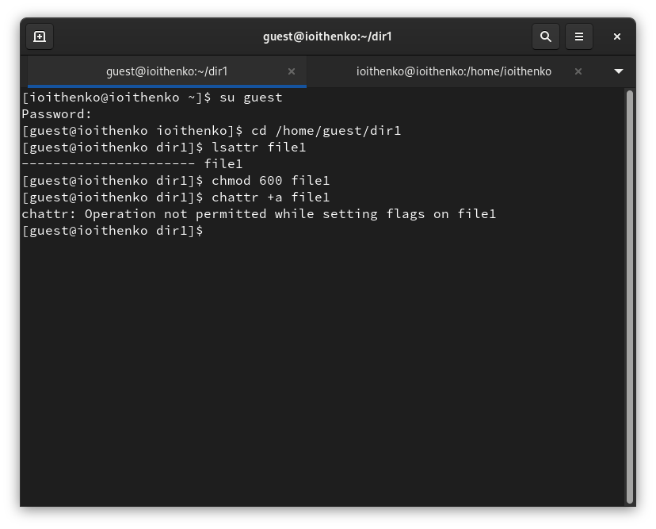
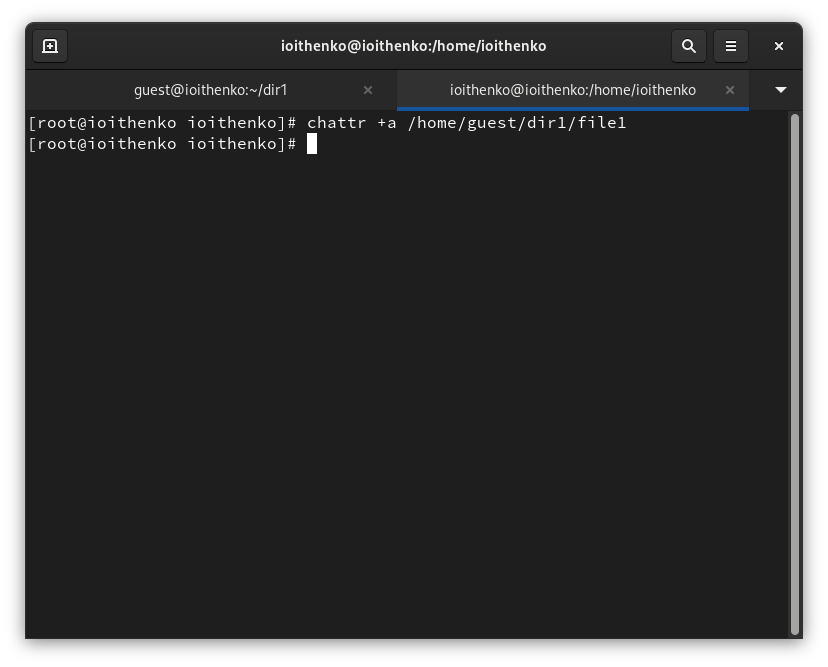
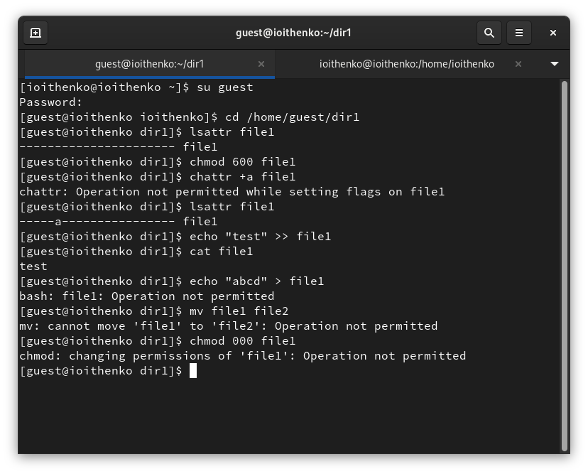
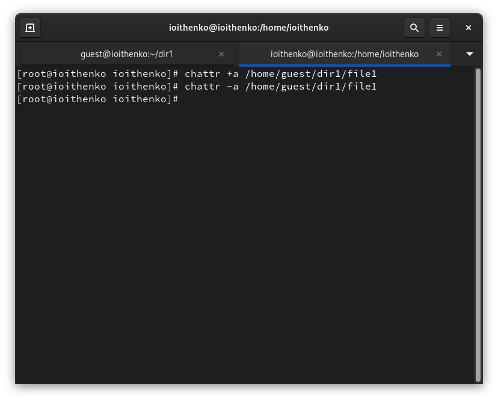
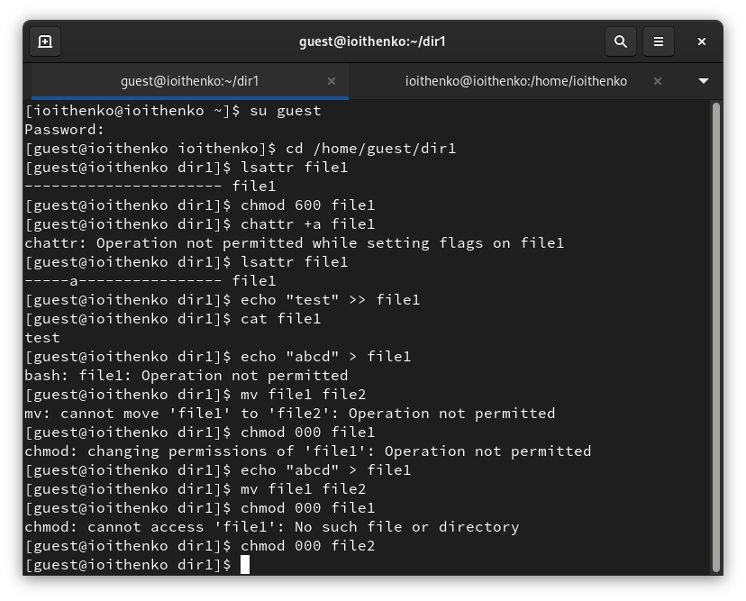
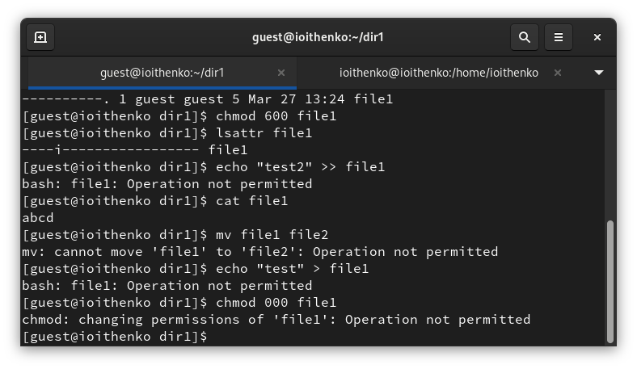
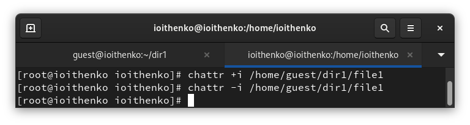
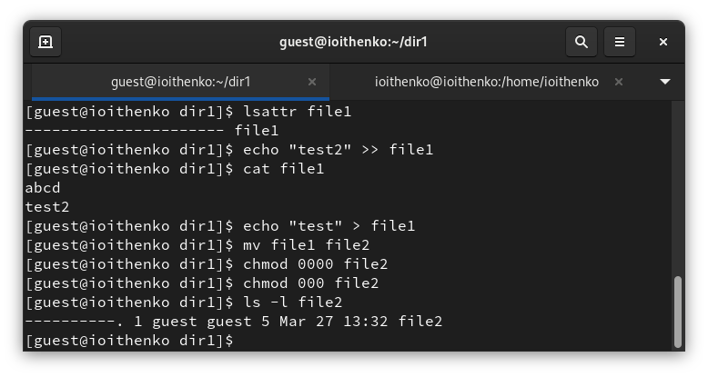

---
## Front matter
lang: ru-RU
title: Лабораторная работа №4
subtitle: Основы информационной безопасности
author:
  - Ищенко Ирина
institute:
  - Российский университет дружбы народов, Москва, Россия

## i18n babel
babel-lang: russian
babel-otherlangs: english

## Formatting pdf
toc: false
toc-title: Содержание
slide_level: 2
aspectratio: 169
section-titles: true
theme: metropolis
header-includes:
 - \metroset{progressbar=frametitle,sectionpage=progressbar,numbering=fraction}
 - '\makeatletter'
 - '\beamer@ignorenonframefalse'
 - '\makeatother'
---

## Докладчик

:::::::::::::: {.columns align=center}
::: {.column width="70%"}

  * Ищенко Ирина Олеговна
  * НПИбд-02-22

:::
::: {.column width="30%"}

:::
::::::::::::::

## Цель

Получение практических навыков работы в консоли с расширенными
атрибутами файлов.

# Выполнение лабортаорной работы

## Неудачное добавление атрибута

{#fig:001 width=50%}

## Добавление атрибута

{#fig:002 width=50%}

## Выполнимые и невыполнимые команды

{#fig:003 width=50%}

## Удаление атрибута

{#fig:004 width=50%}

## Выполнение команд без атрибута

{#fig:005 width=50%}

## Только чтение

{#fig:006 width=70%}

## Изменение атрибута

{#fig:007 width=70%}

## Команды без атрибута

{#fig:008 width=70%}

## Вывод

В результате выполнения работы я повысила свои навыки использования интерфейса командой строки (CLI), познакомились на примерах с тем,
как используются основные и расширенные атрибуты при разграничении
доступа. Имела возможность связать теорию дискреционного разделения
доступа (дискреционная политика безопасности) с её реализацией на практике в ОС Linux. Опробовала действие на практике расширенных атрибутов «а» и «i».