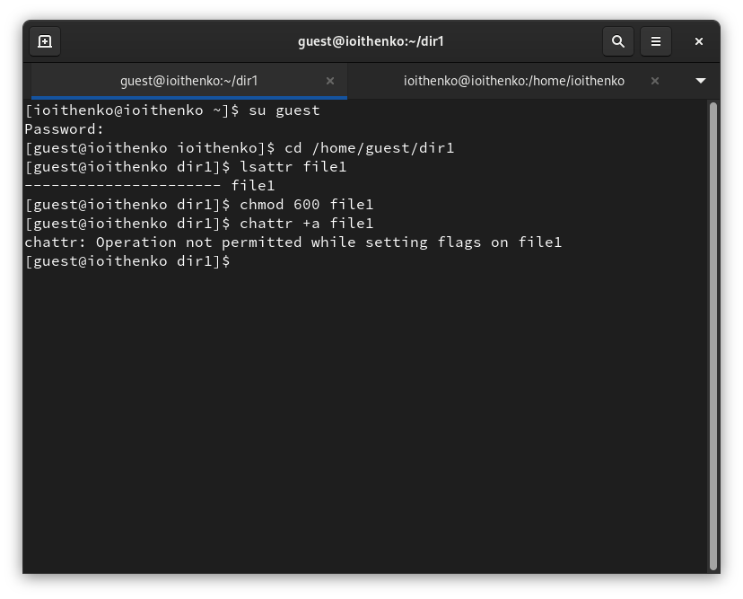
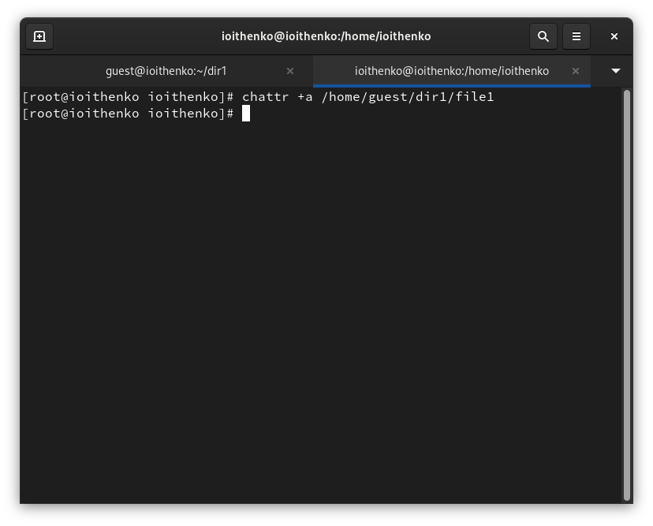
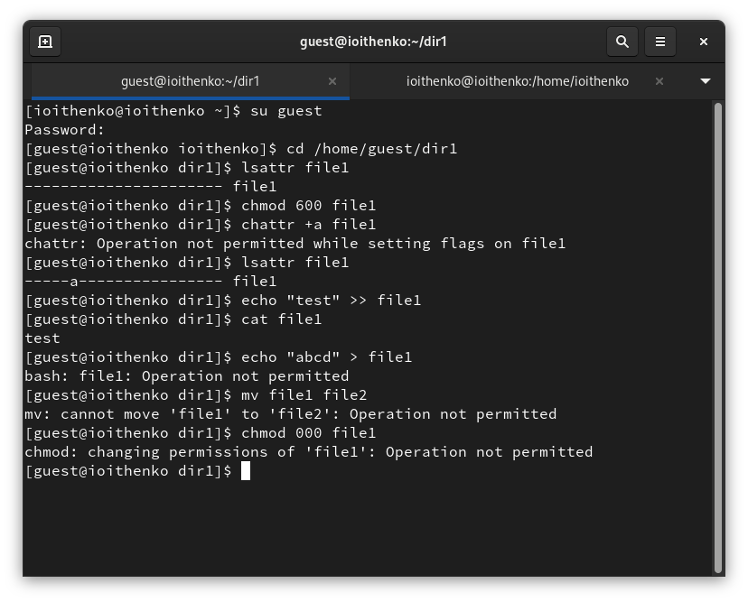
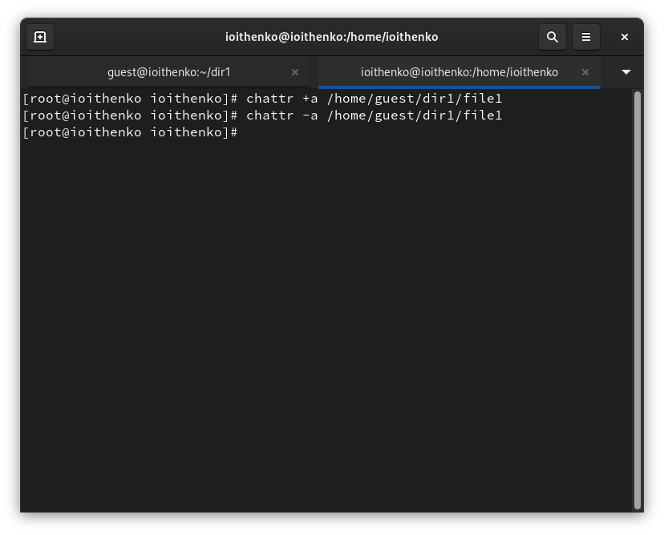
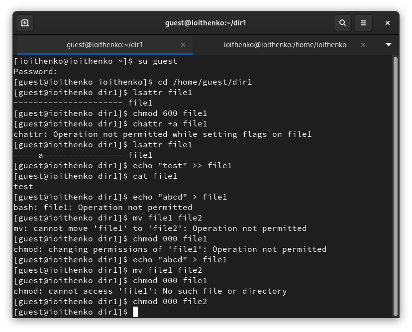
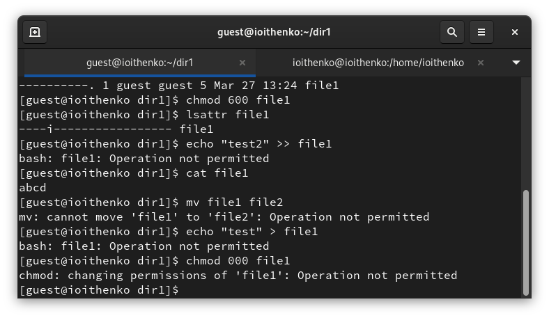
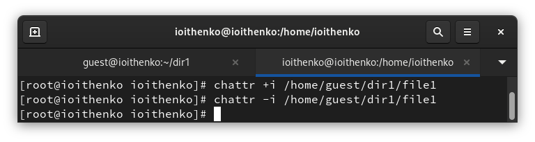
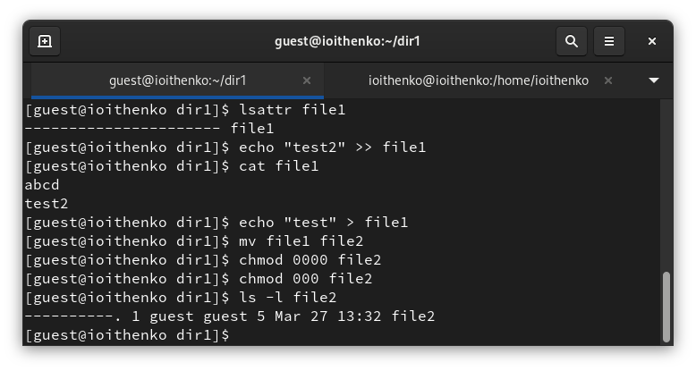

---
## Front matter
title: "Отчет по лабораторной работе №4"
subtitle: "Основы информационной безопасности"
author: "Ищенко Ирина НПИбд-02-22"

## Generic otions
lang: ru-RU
toc-title: "Содержание"

## Bibliography
bibliography: bib/cite.bib
csl: pandoc/csl/gost-r-7-0-5-2008-numeric.csl

## Pdf output format
toc: true # Table of contents
toc-depth: 2
lof: true # List of figures
lot: true # List of tables
fontsize: 12pt
linestretch: 1.5
papersize: a4
documentclass: scrreprt
## I18n polyglossia
polyglossia-lang:
  name: russian
  options:
	- spelling=modern
	- babelshorthands=true
polyglossia-otherlangs:
  name: english
## I18n babel
babel-lang: russian
babel-otherlangs: english
## Fonts
mainfont: PT Serif
romanfont: PT Serif
sansfont: PT Sans
monofont: PT Mono
mainfontoptions: Ligatures=TeX
romanfontoptions: Ligatures=TeX
sansfontoptions: Ligatures=TeX,Scale=MatchLowercase
monofontoptions: Scale=MatchLowercase,Scale=0.9
## Biblatex
biblatex: true
biblio-style: "gost-numeric"
biblatexoptions:
  - parentracker=true
  - backend=biber
  - hyperref=auto
  - language=auto
  - autolang=other*
  - citestyle=gost-numeric
## Pandoc-crossref LaTeX customization
figureTitle: "Рис."
tableTitle: "Таблица"
listingTitle: "Листинг"
lofTitle: "Список иллюстраций"
lotTitle: "Список таблиц"
lolTitle: "Листинги"
## Misc options
indent: true
header-includes:
  - \usepackage{indentfirst}
  - \usepackage{float} # keep figures where there are in the text
  - \floatplacement{figure}{H} # keep figures where there are in the text
---

# Цель работы

Получение практических навыков работы в консоли с расширенными
атрибутами файлов [@infosec].

# Выполнение лабораторной работы

От имени пользователя guest определим расширенные атрибуты файла
/home/guest/dir1/file1 командой
lsattr file1
Установим командой
chmod 600 file1
на файл file1 права, разрешающие чтение и запись для владельца файла.
Попробуйем установить на файл /home/guest/dir1/file1 расширенный атрибут a от имени пользователя guest:
chattr +a file1
В ответ получаем отказ от выполнения операции (рис. [-@fig:001]).

{#fig:001 width=70%}

Зайдем на другую консоль с правами администратора. Попробуем установить расширенный атрибут a на файл /home/guest/dir1/file1 от имени суперпользователя (рис. [-@fig:002]):
chattr +a /home/guest/dir1/file1

{#fig:002 width=70%}

От пользователя guest проверим правильность установления атрибута:
lsattr /home/guest/dir1/file1
Выполним дозапись в файл file1 слова «test» командой
echo "test" /home/guest/dir1/file1
После этого выполним чтение файла file1 командой
cat /home/guest/dir1/file1
Убедимся, что слово test было успешно записано в file1.
Попробуем стереть имеющуюся в нём информацию командой
echo "abcd" > /home/guest/dirl/file1
Попробуем переименовать файл.
Попробуем с помощью команды
chmod 000 file1
установить на файл file1 права, например, запрещающие чтение и запись для владельца файла. Удалось выполнить лишь дозапись в файл и его чтение, в выполнении остальных операций был отказ (рис. [-@fig:003]).

{#fig:003 width=70%}

Снимем расширенный атрибут a с файла /home/guest/dirl/file1 от
имени суперпользователя командой (рис. [-@fig:004])
chattr -a /home/guest/dir1/file1

{#fig:004 width=70%}

Повторим операции, которые вам ранее не удавалось выполнить. Без атрибута получается выполнить все команды: перезапись в файл, переименование файла и изменение прав (рис. [-@fig:005]).

{#fig:005 width=70%}

Повторим наши действия по шагам, заменив атрибут «a» атрибутом «i». С данным атрибутом возможно только чтение (рис. [-@fig:006]), (рис. [-@fig:007]) и (рис. [-@fig:008]).

{#fig:006 width=70%}

{#fig:007 width=70%}

{#fig:008 width=70%}

Атрибут a позволяет добавлять изменения в файл. Атрибут i запрещает вносить любые изменения в файл.

# Выводы

В результате выполнения работы я повысила свои навыки использования интерфейса командой строки (CLI), познакомились на примерах с тем,
как используются основные и расширенные атрибуты при разграничении
доступа. Имела возможность связать теорию дискреционного разделения
доступа (дискреционная политика безопасности) с её реализацией на практике в ОС Linux. Опробовала действие на практике расширенных атрибутов «а» и «i».

# Список литературы{.unnumbered}

::: {#refs}
:::
