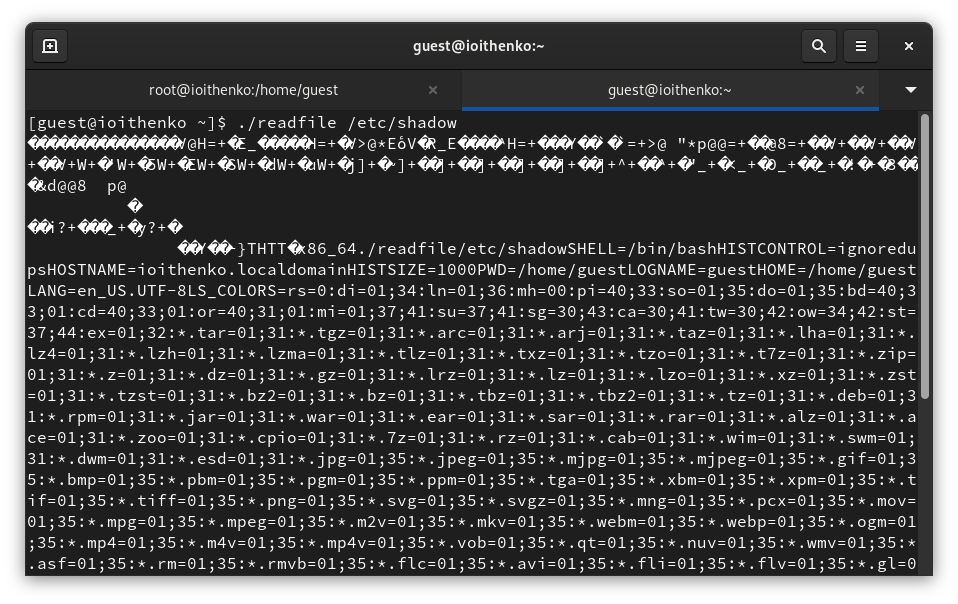

---
## Front matter
title: "Отчёт по лабораторной работе №5"
subtitle: "Основы информационной безопасности"
author: "Ищенко Ирина НПИбд-02-22"

## Generic otions
lang: ru-RU
toc-title: "Содержание"

## Bibliography
bibliography: bib/cite.bib
csl: pandoc/csl/gost-r-7-0-5-2008-numeric.csl

## Pdf output format
toc: true # Table of contents
toc-depth: 2
lof: true # List of figures
lot: true # List of tables
fontsize: 12pt
linestretch: 1.5
papersize: a4
documentclass: scrreprt
## I18n polyglossia
polyglossia-lang:
  name: russian
  options:
	- spelling=modern
	- babelshorthands=true
polyglossia-otherlangs:
  name: english
## I18n babel
babel-lang: russian
babel-otherlangs: english
## Fonts
mainfont: PT Serif
romanfont: PT Serif
sansfont: PT Sans
monofont: PT Mono
mainfontoptions: Ligatures=TeX
romanfontoptions: Ligatures=TeX
sansfontoptions: Ligatures=TeX,Scale=MatchLowercase
monofontoptions: Scale=MatchLowercase,Scale=0.9
## Biblatex
biblatex: true
biblio-style: "gost-numeric"
biblatexoptions:
  - parentracker=true
  - backend=biber
  - hyperref=auto
  - language=auto
  - autolang=other*
  - citestyle=gost-numeric
## Pandoc-crossref LaTeX customization
figureTitle: "Рис."
tableTitle: "Таблица"
listingTitle: "Листинг"
lofTitle: "Список иллюстраций"
lotTitle: "Список таблиц"
lolTitle: "Листинги"
## Misc options
indent: true
header-includes:
  - \usepackage{indentfirst}
  - \usepackage{float} # keep figures where there are in the text
  - \floatplacement{figure}{H} # keep figures where there are in the text
---

# Цель работы

Изучение механизмов изменения идентификаторов, применения
SetUID- и Sticky-битов. Получение практических навыков работы в консоли с дополнительными атрибутами. Рассмотрение работы механизма
смены идентификатора процессов пользователей, а также влияние бита
Sticky на запись и удаление файлов[@infosec].

# Выполнение лабораторной работы

Войдем в систему от имени пользователя guest.
Создадим программу simpleid.c (рис. [-@fig:001]):

{#fig:001 width=70%}

Скомплилируем программу и убедимся, что файл программы создан:
gcc simpleid.c -o simpleid
Выполним программу simpleid:
./simpleid
Выполним системную программу id:
id
и сравним полученный вами результат с данными предыдущего пункта
задания. Данные совпадают (рис. [-@fig:002]). 

{#fig:002 width=70%}

Усложним программу, добавив вывод действительных идентификаторов (рис. [-@fig:003]):

{#fig:003 width=70%}

Скомпилируем и запустим simpleid02.c:
gcc simpleid02.c -o simpleid02
./simpleid2 (рис. [-@fig:004]).

{#fig:004 width=70%}

От имени суперпользователя выполниv команды:
chown root:guest /home/guest/simpleid2
chmod u+s /home/guest/simpleid2
Т.е. изменяем владельца файла и добавляем атрибут.

Выполним проверку правильности установки новых атрибутов и смены
владельца файла simpleid02:
ls -l simpleid02
Запустим simpleid02 и id:
./simpleid02
id
Сравним результаты. Данные совпадают (рис. [-@fig:005]).

{#fig:005 width=70%}

Создадим программу readfile.c (рис. [-@fig:006]):

{#fig:006 width=70%}

Откомпилируем её.
gcc readfile.c -o readfile

Сменим владельца у файла readfile.c (или любого другого текстового
файла в системе) и изменим права так, чтобы только суперпользователь
(root) мог прочитать его, a guest не мог (рис. [-@fig:007]).

{#fig:007 width=70%}

Проверим, что пользователь guest не может прочитать файл readfile.c (рис. [-@fig:008]).

{#fig:008 width=70%}

Сменим у программы readfile владельца и установим SetU’D-бит (рис. [-@fig:009]).

{#fig:009 width=70%}

Проверим, может ли программа readfile прочитать файл readfile.c? Может (рис. [-@fig:0010]).

{#fig:0010 width=70%}

Проверим, может ли программа readfile прочитать файл /etc/shadow? Может (рис. [-@fig:0011]).

{#fig:0011 width=70%}

Выясним, установлен ли атрибут Sticky на директории /tmp, для чего
выполните команду
ls -l / | grep tmp
От имени пользователя guest создадим файл file01.txt в директории /tmp
со словом test:
echo "test" > /tmp/file01.txt
Просмотрим атрибуты у только что созданного файла и разрешим чтение и запись для категории пользователей «все остальные»:
ls -l /tmp/file01.txt
chmod o+rw /tmp/file01.txt
ls -l /tmp/file01.txt (рис. [-@fig:0012]).

{#fig:0012 width=70%}

От пользователя guest2 (не являющегося владельцем) попробуем прочитать файл /tmp/file01.txt:
cat /tmp/file01.txt
От пользователя guest2 попробуем дозаписать в файл
/tmp/file01.txt слово test2 командой
echo "test2" >> /tmp/file01.txt
Удалось ли вам выполнить операцию? Не удалось.
Проверим содержимое файла командой
cat /tmp/file01.txt
От пользователя guest2 попробуем записать в файл /tmp/file01.txt
слово test3, стерев при этом всю имеющуюся в файле информацию командой
echo "test3" > /tmp/file01.txt
Удалось ли вам выполнить операцию? Не удалось.
Проверим содержимое файла командой
cat /tmp/file01.txt
От пользователя guest2 попробуем удалить файл /tmp/file01.txt командой
rm /tmp/fileOl.txt
Удалось ли вам удалить файл? Не удалось (рис. [-@fig:0013]).

{#fig:0013 width=70%}

Повысим свои права до суперпользователя следующей командой
su -
и выполним после этого команду, снимающую атрибут t (Sticky-бит) с
директории /tmp:
chmod -t /tmp
Покинем режим суперпользователя командой
exit
От пользователя guest2 проверим, что атрибута t у директории /tmp
нет:
ls -l / | grep tmp
Повторим предыдущие шаги. 
Удалось ли вам удалить файл от имени пользователя, не являющегося
его владельцем? Удалось выполнить только удаление файла, записать и дозаписать не получилось.
Повысим свои права до суперпользователя и вернем атрибут t на директорию /tmp (рис. [-@fig:0014]):
su -
chmod +t /tmp
exit

{#fig:0014 width=70%}

# Выводы

В ходе лабораторной работы я изучила механизмы изменения идентификаторов, применения
SetUID- и Sticky-битов. Получила практические навыков работы в консоли с дополнительными атрибутами. Рассмотрела работы механизма смены идентификатора процессов пользователей, а также влияние бита Sticky на запись и удаление файлов.

# Список литературы{.unnumbered}

::: {#refs}
:::
