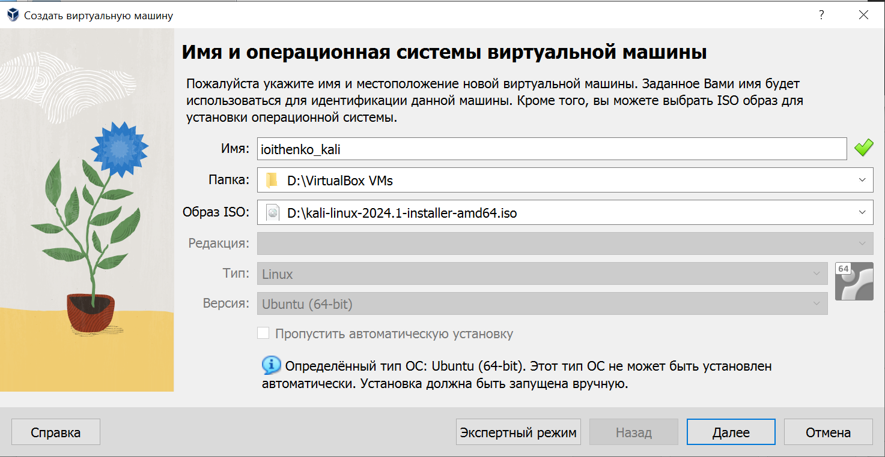
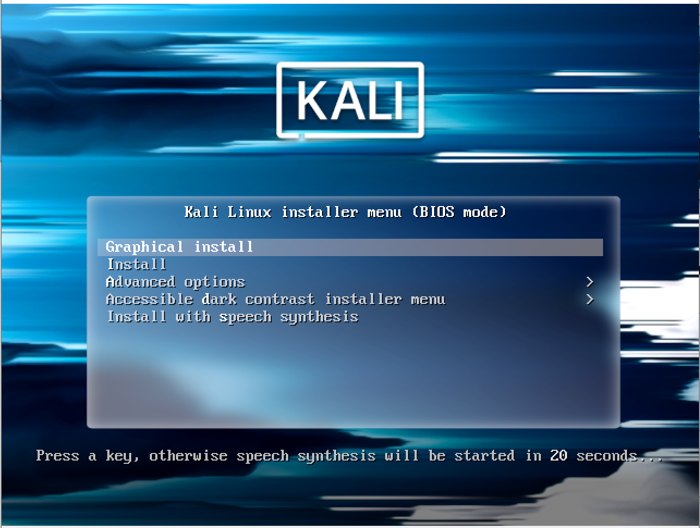
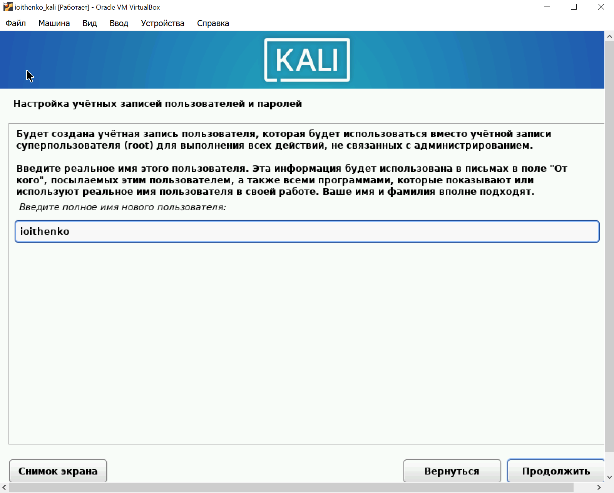
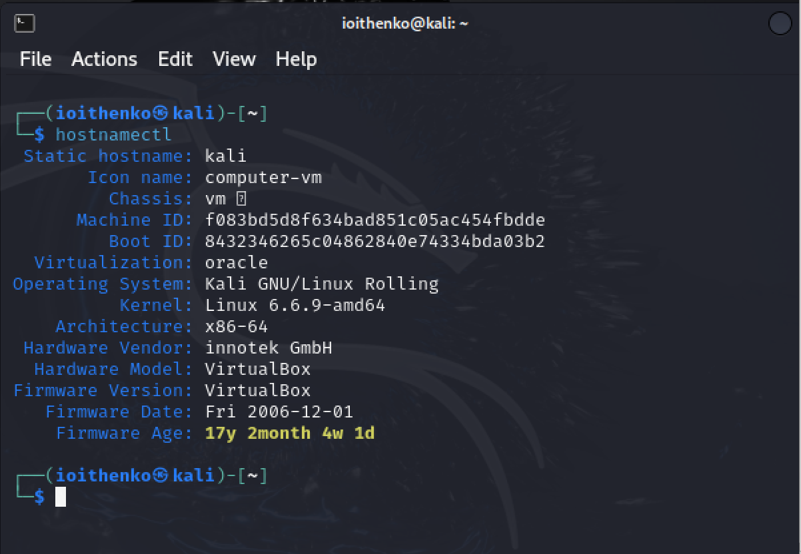

---
## Front matter
lang: ru-RU
title: Проект. Этап 1
subtitle: Основы информационной безопасности
author:
  - Ищенко Ирина 
institute:
  - Российский университет дружбы народов, Москва, Россия

date: 29 февраля 2024

## i18n babel
babel-lang: russian
babel-otherlangs: english

## Fonts
mainfont: PT Serif
romanfont: PT Serif
sansfont: PT Sans
monofont: PT Mono
mainfontoptions: Ligatures=TeX
romanfontoptions: Ligatures=TeX
sansfontoptions: Ligatures=TeX,Scale=MatchLowercase
monofontoptions: Scale=MatchLowercase,Scale=0.9

## Formatting pdf
toc: false
toc-title: Содержание
slide_level: 2
aspectratio: 169
section-titles: true
theme: metropolis
header-includes:
 - \metroset{progressbar=frametitle,sectionpage=progressbar,numbering=fraction}
 - '\makeatletter'
 - '\beamer@ignorenonframefalse'
 - '\makeatother'
---

## Докладчик

:::::::::::::: {.columns align=center}
::: {.column width="70%"}

  * Ищенко Ирина
  * НПИбд-02-22

:::
::: {.column width="30%"}

:::
::::::::::::::

## Цель работы

Установка дистрибутива Kali Linux на виртуальную машину.

# Выполнение проекта

## Создание ВМ

{#fig:001 width=50%}

## Запуск

{#fig:002 width=50%}

## Создание пользователя

{#fig:003 width=50%}

## ВМ

{#fig:004 width=50%}

# Вывод

## Вывод

В ходе выполнения этапа проекта я установила дистрибутив Kali Linux на мою ВМ и настроила минимально необходимое ПО.

