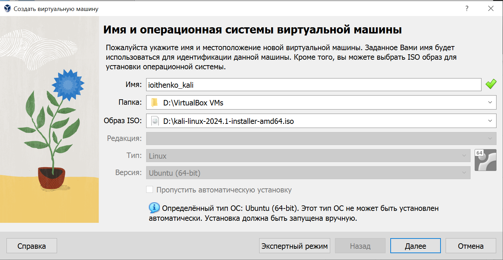
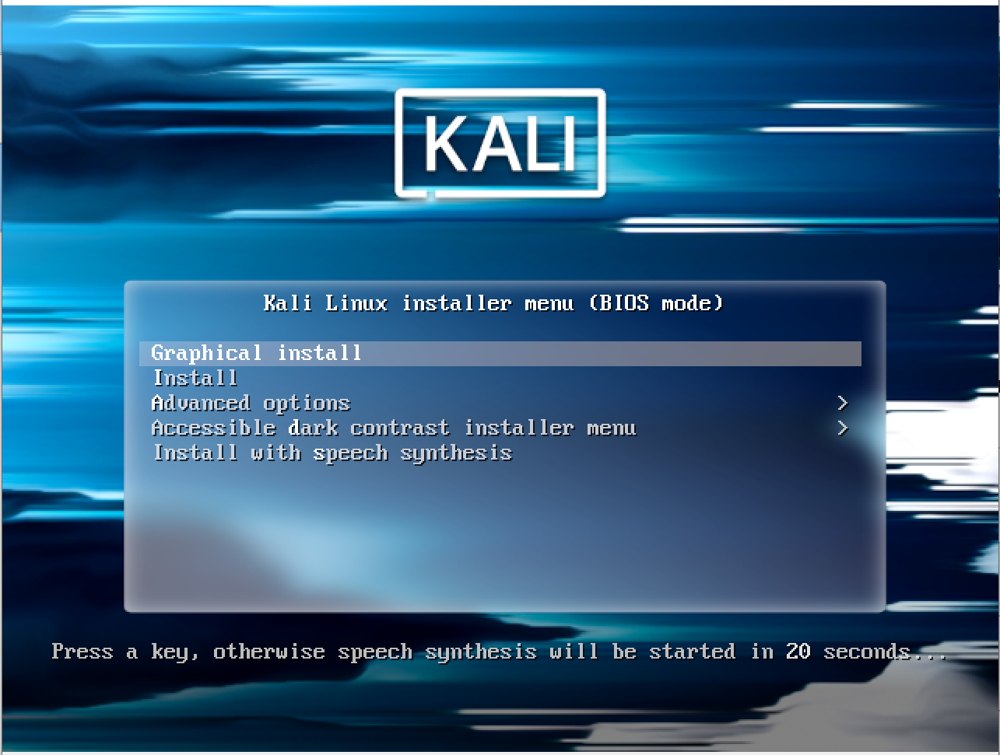
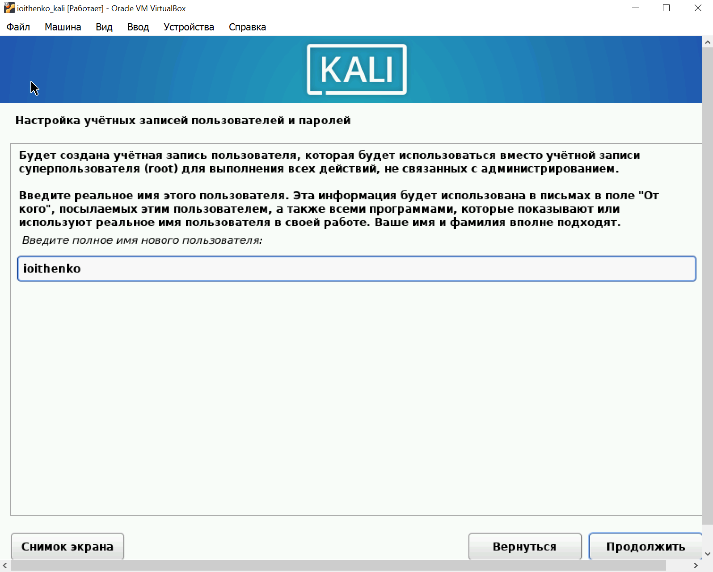
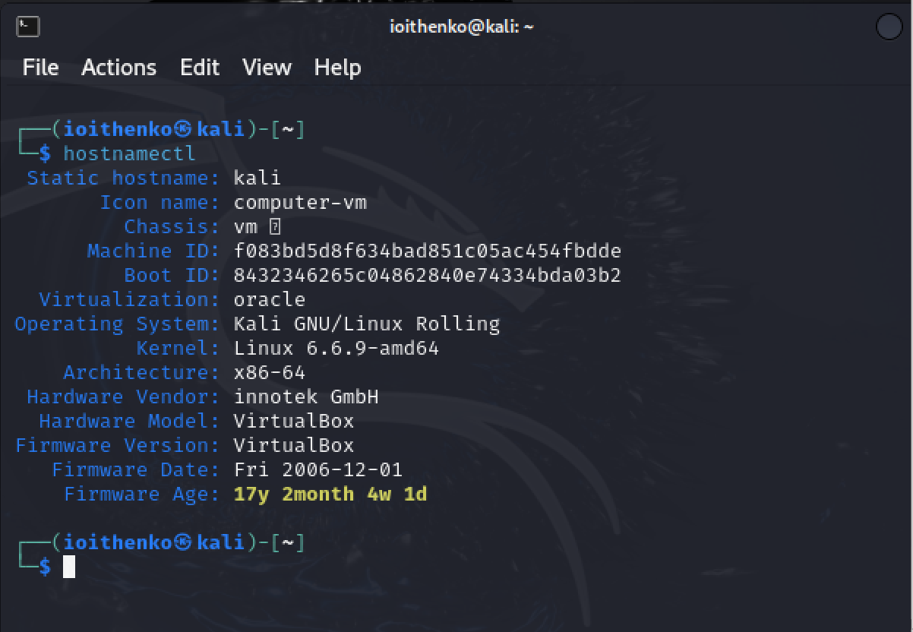

---
## Front matter
title: "Отчёт по индивидуальному проекту. Этап 1"
subtitle: "Основы информационной безопасности"
author: "Ищенко Ирина НПИбд-02-22"

## Generic otions
lang: ru-RU
toc-title: "Содержание"

## Bibliography
bibliography: bib/cite.bib
csl: pandoc/csl/gost-r-7-0-5-2008-numeric.csl

## Pdf output format
toc: true # Table of contents
toc-depth: 2
lof: true # List of figures
lot: true # List of tables
fontsize: 12pt
linestretch: 1.5
papersize: a4
documentclass: scrreprt
## I18n polyglossia
polyglossia-lang:
  name: russian
  options:
	- spelling=modern
	- babelshorthands=true
polyglossia-otherlangs:
  name: english
## I18n babel
babel-lang: russian
babel-otherlangs: english
## Fonts
mainfont: PT Serif
romanfont: PT Serif
sansfont: PT Sans
monofont: PT Mono
mainfontoptions: Ligatures=TeX
romanfontoptions: Ligatures=TeX
sansfontoptions: Ligatures=TeX,Scale=MatchLowercase
monofontoptions: Scale=MatchLowercase,Scale=0.9
## Biblatex
biblatex: true
biblio-style: "gost-numeric"
biblatexoptions:
  - parentracker=true
  - backend=biber
  - hyperref=auto
  - language=auto
  - autolang=other*
  - citestyle=gost-numeric
## Pandoc-crossref LaTeX customization
figureTitle: "Рис."
tableTitle: "Таблица"
listingTitle: "Листинг"
lofTitle: "Список иллюстраций"
lotTitle: "Список таблиц"
lolTitle: "Листинги"
## Misc options
indent: true
header-includes:
  - \usepackage{indentfirst}
  - \usepackage{float} # keep figures where there are in the text
  - \floatplacement{figure}{H} # keep figures where there are in the text
---

# Цель работы

Установка дистрибутива Kali Linux на виртуальную машину[@kali].

# Выполнение проекта

Скачали ISO образ с официального сайта Kali Linux. Создали виртуальную машину, указали имя машины, ее расположение и добавили ISO образ (рис. [-@fig:001]). Указали размер оперативной памяти. Создали виртуальный жесткий диск и выделили память в размере 40 Гб.

{#fig:001 width=70%}

Запустили ВМ (рис. [-@fig:002]). Выбрали графическую установку. Указали язык, настроили время, раскладку клавиатуры. Указали домен. Оставили параметры установки по умолчанию. 

{#fig:002 width=70%}

Создали учетную запись с моим логином и задали пароль (рис. [-@fig:003]).

{#fig:003 width=70%}

После установки перезапустили виртуальную машину. Открыли терминал и проверили его работу (рис. [-@fig:004]).

{#fig:004 width=70%}

# Выводы

В ходе выполнения этапа проекта я установила дистрибутив Kali Linux на мою ВМ.

# Список литературы{.unnumbered}

::: {#refs}
:::
